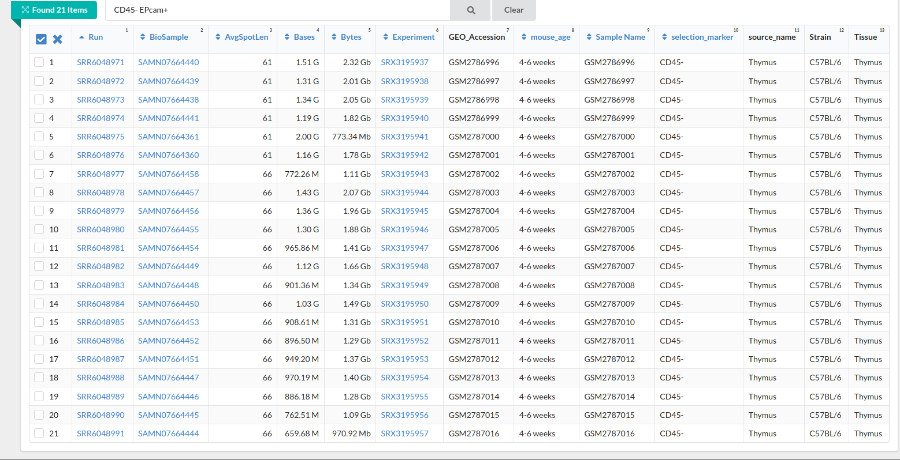
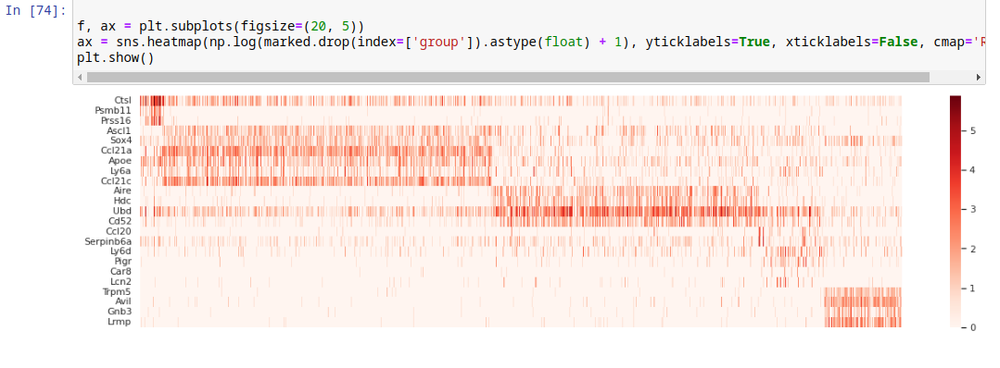
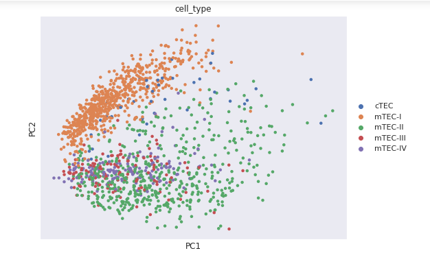
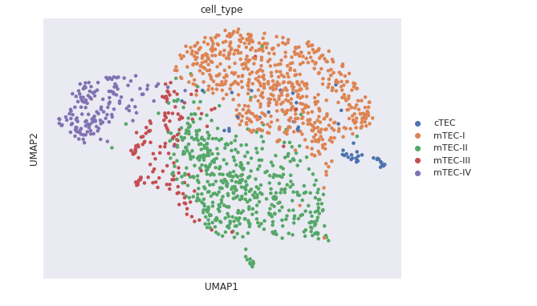

## Отчет

Работа выполнена на личном сервере - гугл колаб показывает слишком малые результаты производительности. 

Результатом работы является [Jupyter notebook](src/hw5.ipynb).

В [папке src](src/) данного репозитория также хранится файл от авторов, т.к. он был скачан руками и предполагается существуюющим для корректной работы jupyter ноутбука.

Во время работы отдельное внимание уделено расхождению с образцом - в примере google colab ноутбука утвержден размер матрицы counts 34016 x 8064. Однако, воспользовавшись SRA Run Selector, можно утверждать, что количество столбцов будет равно 4032: в каждом из 21 файла их по 192. 

Согласно заданию:
1. Получена count-матрица
2. Произведена нормализация данных
3. Построен heatmap-график для экспрессии маркерных генов:

4. Построена визуализация данных на основе umap и pca:

Выводом по работе можно назвать следующий тезис: типы клеток cTEC, mTEC-1, mTEC-2, mTEC-3 и mTEC-4 не однозначно поддаются кластеризации по типу клеток и сделать вывод о их историческом происхождении (из одной клетки предшественника или одного типа из другого) достоверно нельзя.
